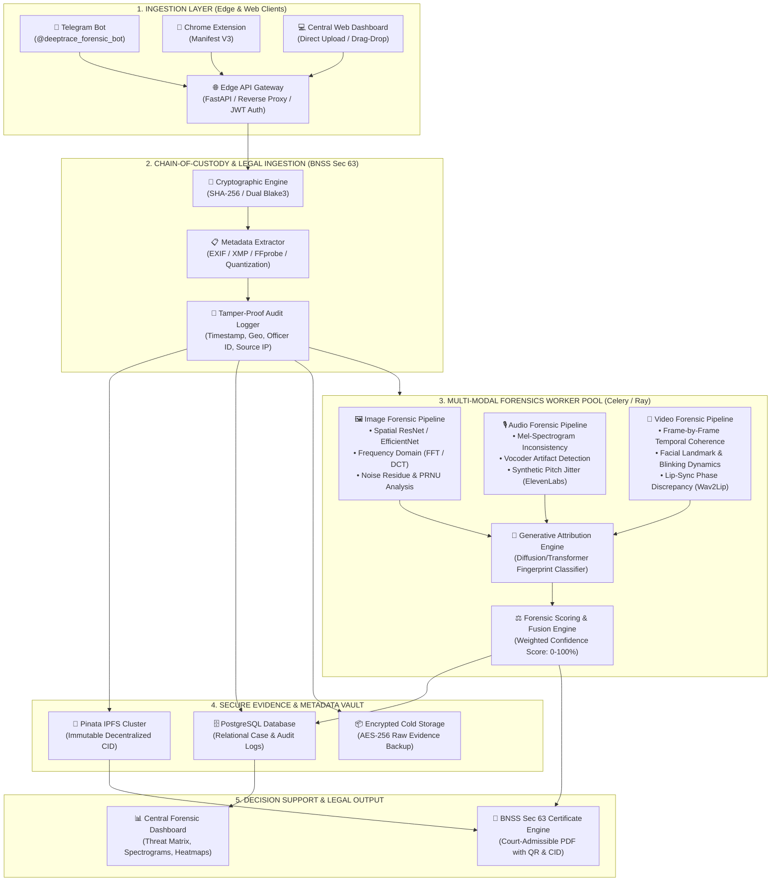
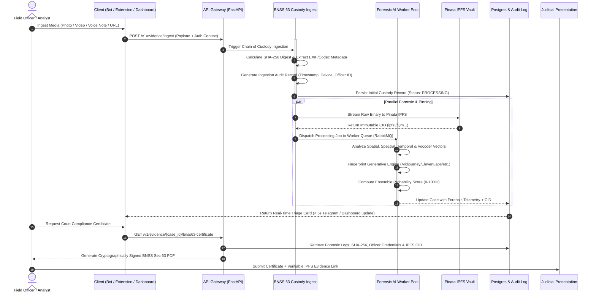
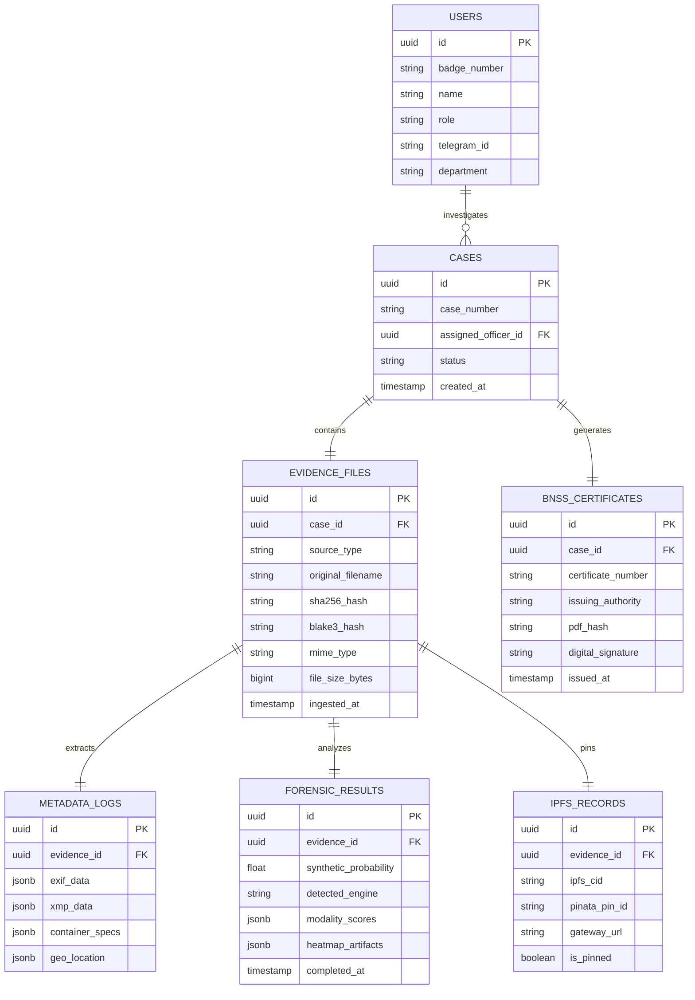

# DeepTrace — Multi-Modal AI Forensics & Legal Compliance Architecture

## 1. System Overview & Mission

**DeepTrace** is an enterprise-grade forensic intelligence and evidence management platform designed for law enforcement, judicial bodies, cyber defense units, and digital investigators. 

The platform addresses the critical challenge of synthetic media weaponization (deepfakes, generative voices, synthetic identities) while strictly complying with the statutory requirements of **Section 63 of the Bharatiya Nagarik Suraksha Sanhita, 2023 (BNSS 2023)** (which supersedes Section 65B of the Indian Evidence Act for the admissibility of electronic records in Indian courts).

---

## 2. Key System Features

1. **🔬 Dynamic Multi-Modal AI Forensics Engine**: 
   - Parallel multi-modal evaluation across **Images**, **Audio**, and **Video**.
   - Dual-tier analysis: AI Probability Score (0–100%) and Generative Engine Fingerprinting (Midjourney, Stable Diffusion XL, DALL-E, ElevenLabs, Tortoise, Sora, Runway Gen-2, Wav2Lip).
2. **📜 Legal Compliance Engine (BNSS 2023 Section 63)**:
   - Instant calculation of cryptographic SHA-256 digests upon acquisition.
   - Deep extraction of EXIF, container metadata, quantization tables, and device profiles.
   - Generation of court-admissible electronic record certificates (Form BNSS-63 Schedule II).
3. **🔗 Immutable IPFS Evidence Vault**:
   - Content-addressed decentralized pinning via **Pinata IPFS Gateway**.
   - Tamper-evident Content Identifier (CID) generation ensuring non-repudiation and permanent integrity.
4. **📱 On-Field Telegram Bot (`@deeptrace_forensic_bot`)**:
   - Mobile-first rapid verification for frontline officers.
   - Low-latency edge triage (<5s) with automated evidence case logging.
5. **🧩 Inspector Chrome Extension (Manifest V3)**:
   - One-click browser media audit directly on web pages, social media, and web-based messaging apps.
   - Background streaming to API with DOM source lineage extraction.
6. **📊 Central Forensic Web Dashboard**:
   - Real-time threat telemetry, case management, deep forensic inspection (heatmaps, spectrograms), and certificate generation.

---

## 3. High-Level System Architecture

---

## 4. End-to-End Operational Workflow ("The Way It Works")

The life cycle of a forensic item from field ingestion to judicial presentation comprises five distinct stages:

---

## 5. Component Deep Dive

### 5.1 Ingestion Clients

#### A. On-Field Telegram Bot (`@deeptrace_forensic_bot`)
- **Target Persona**: Frontline police officers, election surveillance teams, patrolling units.
- **Workflow**:
  1. Officer sends/forwards an image, video, audio clip, or document.
  2. The bot validates the officer’s mobile phone number / Telegram User ID against the department whitelist.
  3. Raw uncompressed file stream is captured directly using Telegram Bot API (`getFile` endpoint).
  4. Instant reply within 5 seconds with an **Executive Forensic Summary**:
     - 🚨 AI Probability Score: `87.4% (LIKELY SYNTHETIC)`
     - 🧬 Engine: `Identified Artifacts matching Stable Diffusion XL`
     - 🔐 SHA-256: `9f86d081884c7d659a2feaa0c55ad015a3bf4f1b2b0b822cd15d6c15b0f00a08`
     - 🔗 View Full Report / Case ID: `#DT-2026-8812`

#### B. Inspector Chrome Extension (Manifest V3)
- **Target Persona**: Cyber cell analysts, open-source intelligence (OSINT) investigators, fact-checkers.
- **Workflow**:
  1. Context Menu Integration: Right-click any image, video, or audio tag on Twitter/X, Instagram, WhatsApp Web, YouTube.
  2. The Manifest V3 Background Service Worker intercepts the media URL and fetches raw blob streams.
  3. Source DOM metadata (original page URL, publisher, timestamp, dimensions) is packaged alongside the asset.
  4. Floating inspect badge renders inline threat evaluation without navigating away.

#### C. Central Forensic Web Dashboard
- **Target Persona**: Chief Forensic Examiners, Digital Evidence Officers, Superintendents of Police.
- **Capabilities**:
  - Drag-and-drop batch ingestion with drag-over SHA-256 client-side preview.
  - Multi-case search, filtering by generative model, threat level, officer ID, and date range.
  - Interactive forensic viewers:
    - Grad-CAM heatmaps overlaying manipulated facial zones.
    - 3D Mel-Spectrogram audio visualizer highlighting vocoder harmonics.
    - Temporal video frame-by-frame anomaly graph.

---

### 5.2 Legal Compliance Engine (BNSS 2023 Sec 63)

Under **Section 63 of Bharatiya Nagarik Suraksha Sanhita, 2023**, electronic evidence is admissible in court provided its integrity and uninterrupted chain of custody are established by a certified officer.

1. **Immediate Cryptographic Sealing**:
   - The exact byte-stream arriving at the gateway is digested via SHA-256:
     $$\text{Digest} = \text{SHA-256}(\text{Raw Binary})$$
   - An optional dual Blake3 digest provides ultra-fast secondary verification.
2. **Metadata Harvest**:
   - EXIF/IPTC/XMP parsing: camera make, lens, exposure, GPS coordinates, software tags (e.g., detection of "Photoshop", "Automatic1111", "Midjourney").
   - Container & Codec deep scan: FFprobe container analysis, audio sample rates, video color matrices, NAL units, quantization tables.
3. **Chain of Custody Audit Trail**:
   - System auto-generates a tamper-evident audit record containing:
     - Acquisition Timestamp (UTC + IST with NTP synchronization).
     - Device & Operator ID (IMEI/IP/Officer Badge ID).
     - Ingestion Method (`TELEGRAM_EDGE`, `CHROME_EXT_DOM`, `PORTAL_DIRECT`).
4. **Automated BNSS 2023 Section 63 Certificate Generation**:
   - Dynamically renders a standardized Certificate containing:
     - **Part A**: Identification of the electronic record and describing manner of acquisition.
     - **Part B**: Technical specification of the computer/device and cryptographic hash verification logs.
     - **Part C**: Officer affirmation and digital signature / QR verification code linking to the IPFS immutable record.

---

### 5.3 Multi-Modal AI Forensic Engine

The forensic pipeline runs as asynchronous Celery workers orchestrated on GPU nodes (NVIDIA TensorRT / PyTorch):

| Modality | Forensic Techniques | Target Engines / Clues |
| :--- | :--- | :--- |
| **Images** | • ResNet-50 / EfficientNet-B4 multi-resolution artifact extraction • 2D Fast Fourier Transform (FFT) high-frequency spectrum decay • Photo-Response Non-Uniformity (PRNU) sensor noise verification • Error Level Analysis (ELA) for localized re-compression | Midjourney v5/v6, Stable Diffusion 1.5/XL, DALL-E 3, Flux.1, Adobe Firefly |
| **Audio** | • High-resolution Log Mel-Spectrogram transform • Spectral centroid, zero-crossing rate & phase continuity analysis • Biometric pitch jitter & neural vocoder footprint identification | ElevenLabs, Tortoise-TTS, OpenAI Voice Engine, RVC (Retrieval-based Voice Conversion) |
| **Video** | • Frame-to-frame optical flow & temporal consistency • Facial landmark tracking (eye blinks, involuntary micro-movements) • Audio-Visual lip synchrony correlation (Wav2Lip misalignment) | OpenAI Sora, Runway Gen-2 / Gen-3, Pika Labs, Wav2Lip, DeepFaceLab |

#### Generative Engine Attribution & Score Fusion
- An ensemble classifier maps extracted feature embeddings to known engine signatures.
- Scores are fused using a Bayesian confidence model:
  $$P(\text{Synthetic} \mid F_{\text{spatial}}, F_{\text{frequency}}, F_{\text{temporal}}, F_{\text{metadata}}) \in [0.0, 1.0]$$
- If conflicting signals emerge (e.g., real video with swapped synthetic audio), the system breaks down modality-specific risk scores independently.

---

### 5.4 Immutable IPFS Evidence Vault via Pinata

1. **Why IPFS & Pinata?**:
   - Traditional cloud storage (AWS S3, local servers) can be disputed in court on grounds of administrative alteration or deletion.
   - IPFS is **content-addressed**: The Content Identifier (CID) is mathematically derived from the file contents. If a single bit is altered, the CID changes completely.
2. **Pinning Lifecycle**:
   - Once ingested, the raw evidence file is pushed via Pinata's REST API (`pinFileToIPFS`).
   - The CID (e.g., `ipfs://bafybeic...`) is pinned across distributed IPFS nodes.
   - The resulting CID is permanently bound to the PostgreSQL case record and printed on the BNSS Sec 63 certificate.
   - Anyone (court, defense, forensic lab) can verify that:
     $$\text{IPFS\_CID}(\text{Evidence}) \equiv \text{CID recorded on Certificate}$$

---

## 6. Data Architecture & Database Schema

---

## 7. Recommended Technology Stack

| Layer | Component | Recommended Technology |
| :--- | :--- | :--- |
| **Edge & Ingestion** | Telegram Bot | Python `python-telegram-bot` (AsyncIO) |
| | Browser Extension | JavaScript/TypeScript (Chrome Manifest V3) |
| | Web Frontend | React / Next.js, TailwindCSS, Lucide Icons, Shadcn UI |
| **API & Coordination** | API Gateway | FastAPI (Python 3.11+), Pydantic v2 |
| | Task Queue | Celery + Redis / RabbitMQ |
| **Forensics & AI** | Image Forensics | PyTorch, Timm (EfficientNet, ConvNeXt), OpenCV |
| | Audio Forensics | Librosa, Torchaudio, Whisper-feature extraction |
| | Video Forensics | Decord / OpenCV, Mediapipe, Facenet-PyTorch |
| **Storage & Security** | Decentralized Storage | Pinata IPFS API (Pinata SDK) |
| | Relational Database | PostgreSQL 16 + pgvector (for biometric search) |
| | Blob Cache | MinIO / AWS S3 (Encrypted at rest with KMS) |
| **Legal / Compliance** | Certificate Generation | ReportLab / WeasyPrint (BNSS 63 PDF engine) |
| | Cryptography | `hashlib`, `cryptography` (RSA/ECDSA signatures) |
